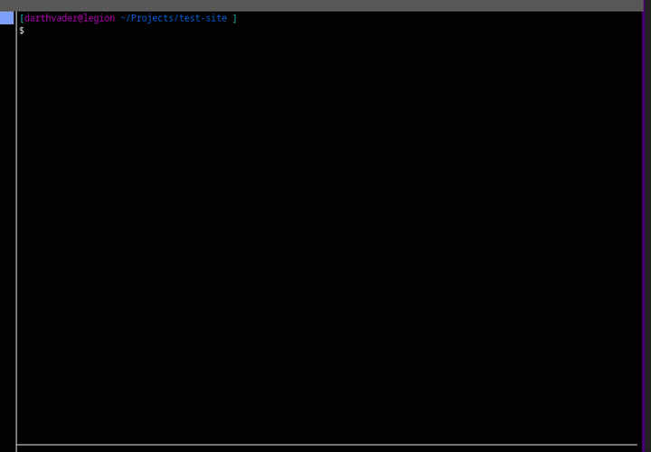
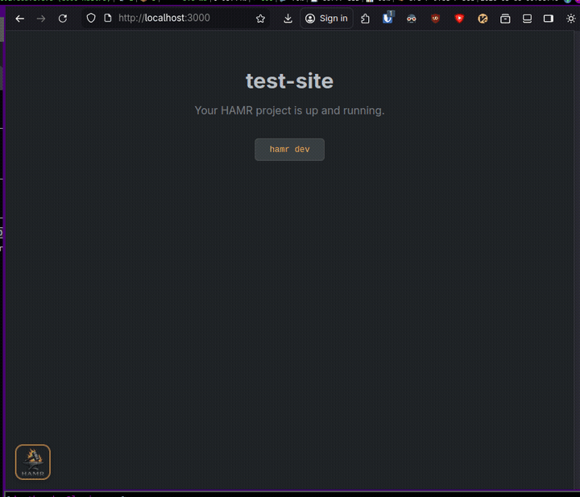

# Disclaimer
This library and cli is still in development and can/will change. Meaning, if you use this now, features might be deprecated and you might need to pin version.

# HAMR






An opinionated Go full-stack framework and project scaffolding CLI. HAMR extracts proven patterns from production Go web applications into reusable packages and gives you a working project with one command.

<br clear="left">

```
hamr new
```

You get a production-ready Go + Templ + HTMX application (with optional Alpine.js) with sensible defaults, structured logging, database migrations, session auth, and AI-ready documentation baked in.

## Documentation

- **[HAMR Guide](docs/guide/README.md)** -- Learn how to build with HAMR, from [project setup](docs/guide/01-project-setup.md) through [deployment](docs/guide/13-deployment.md)
- **[Package Reference](docs/guide/pkg/README.md)** -- Full API docs for every `hamr/pkg` package
- **[CLI Reference](docs/guide/cli.md)** -- All `hamr` commands and flags

## What's in the box

HAMR is two things:

1. **Framework library** (`pkg/`) -- reusable Go packages your project imports
2. **CLI tool** (`cmd/hamr/`) -- scaffolds new projects that use the framework

### Framework packages

| Package            | What it does                                                                       | Guide |
| ------------------ | ---------------------------------------------------------------------------------- | ----- |
| `pkg/config`       | Env-based configuration with typed accessors and `.env` file loading               | [docs/guide/pkg/config.md](docs/guide/pkg/config.md) |
| `pkg/logging`      | Context-aware structured logging via `slog` (JSON in prod, coloured in dev)        | [docs/guide/pkg/logging.md](docs/guide/pkg/logging.md) |
| `pkg/ptr`          | Generic and concrete pointer helpers                                               | [docs/guide/pkg/ptr.md](docs/guide/pkg/ptr.md) |
| `pkg/validate`     | Pure-function validators with custom messages and a plugin registry                | [docs/guide/pkg/validate.md](docs/guide/pkg/validate.md) |
| `pkg/auth`         | Argon2id password hashing, token generation, session management                    | [docs/guide/pkg/auth.md](docs/guide/pkg/auth.md) |
| `pkg/db`           | Database connection with retry, keep-alive, and migration runner                   | [docs/guide/pkg/db.md](docs/guide/pkg/db.md) |
| `pkg/htmx`         | HTMX request detection and response header helpers                                 | [docs/guide/pkg/htmx.md](docs/guide/pkg/htmx.md) |
| `pkg/respond`      | HTTP response helpers (HTML via Templ, JSON, HTMX-aware redirects)                 | [docs/guide/pkg/respond.md](docs/guide/pkg/respond.md) |
| `pkg/ctx`          | Type-safe Echo context keys using generics                                         | [docs/guide/pkg/ctx.md](docs/guide/pkg/ctx.md) |
| `pkg/middleware`   | Auth, RBAC, error pages, flash, rate limiting, caching, audit, CSRF, CORS          | [docs/guide/pkg/middleware.md](docs/guide/pkg/middleware.md) |
| `pkg/server`       | Echo wrapper with functional options and lifecycle hooks                           | [docs/guide/pkg/server.md](docs/guide/pkg/server.md) |
| `pkg/janitor`      | Background task scheduler                                                          | [docs/guide/pkg/janitor.md](docs/guide/pkg/janitor.md) |
| `pkg/storage`      | File storage interface with local filesystem and S3/R2/RustFS backends             | [docs/guide/pkg/storage.md](docs/guide/pkg/storage.md) |
| `pkg/async`        | Concurrent execution primitives with panic recovery                                | [docs/guide/pkg/async.md](docs/guide/pkg/async.md) |
| `pkg/websocket`    | Session and room-based WebSocket hub with HTMX integration                         | [docs/guide/pkg/websocket.md](docs/guide/pkg/websocket.md) |
| `pkg/media`        | Image and video upload, processing, and serving on top of storage                  | [docs/guide/pkg/media.md](docs/guide/pkg/media.md) |
| `pkg/sync`         | S3 sync for static assets with file watching                                       | [docs/guide/pkg/sync.md](docs/guide/pkg/sync.md) |
| `pkg/e2e`          | Reusable go-rod browser helpers for E2E testing                                    | [docs/guide/pkg/e2e.md](docs/guide/pkg/e2e.md) |
| `pkg/templint`     | Static linter for `.templ` files (control flow, a11y, style rules)                 | [docs/guide/pkg/templint.md](docs/guide/pkg/templint.md) |

### CLI commands

| Command                     | What it does                                                        |
| --------------------------- | ------------------------------------------------------------------- |
| `hamr new <name>`           | Scaffold a new project with interactive options                     |
| `hamr dev`                  | File watching, builds, process management, and live-reload proxy    |
| `hamr setup`                | Interactive AI-agent setup: MCP bridge, tool permissions, skills     |
| `hamr ai capture <url>`     | Capture a browser screenshot bundle, plus HTML/text/metadata        |
| `hamr ai upgrade`           | Diff scaffold changes between project version and current HAMR      |
| `hamr gen static`           | Fingerprint static assets into dist/ with compile-time manifest     |
| `hamr vendor`               | Download and checksum frontend JS dependencies (htmx, alpine, etc) |
| `hamr sync`                 | Sync a local directory to an S3-compatible bucket                   |
| `hamr rename-module <path>` | Rename the Go module and update all import paths                    |
| `hamr lint templ`           | Lint `.templ` files for common issues                               |
| `hamr version`              | Print version and commit                                            |
| `hamr completion install`   | Install shell completion scripts (bash, zsh, fish)                  |

## Install

### CLI tool

```bash
go install github.com/FyrmForge/hamr/cmd/hamr@latest
```

### Framework packages

Import the packages you need in your `go.mod`:

```bash
go get github.com/FyrmForge/hamr@latest
```

Then import individual packages:

```go
import (
    "github.com/FyrmForge/hamr/pkg/config"
    "github.com/FyrmForge/hamr/pkg/logging"
    "github.com/FyrmForge/hamr/pkg/server"
)
```

## Quick start

```bash
# Install the CLI
go install github.com/FyrmForge/hamr/cmd/hamr@latest

# Create a new project
hamr new myproject

# Follow the prompts to choose:
#   - GitHub username/org (auto-detected from gh CLI)
#   - CSS approach (plain CSS with design system or Tailwind)
#   - Database (PostgreSQL)
#   - File storage (none, local, or S3/RustFS)
#   - WebSocket support
#   - E2E testing scaffold

# Run it
cd myproject
hamr dev                    # starts Postgres, builds, watches, live-reloads
```

## Generated project structure

```
myproject/
├── cmd/
│   ├── server/              # Application entry point + Dockerfile
│   └── migrate/             # Database migration runner
├── internal/
│   ├── db/migrations/       # SQL migrations (embed.FS)
│   ├── repo/                # Data access layer (postgres/)
│   ├── service/             # Business logic (auth service)
│   ├── api/                 # JSON API handlers
│   └── web/
│       ├── server.go        # Routes and middleware stack
│       ├── handler/         # One package per domain (home/, auth/, errors/)
│       └── components/      # Shared Templ components and layout
├── static/                  # CSS, JS (vendored HTMX + idiomorph; Alpine if opted in), images
├── docs/                    # ADRs, feature specs, AI guides
├── docker/                  # Docker Compose for PostgreSQL
├── .github/workflows/       # CI and deploy pipelines
├── hamr.toml                # Dev server configuration
├── Makefile
├── CLAUDE.md                # Claude Code instructions
├── AGENTS.md                # AI coding conventions
└── go.mod
```

## Stack

| Layer           | Technology                         |
|-----------------|------------------------------------|
| Language        | Go 1.25+                           |
| HTTP            | Echo v4                            |
| Templates       | Templ                              |
| Interactivity   | HTMX (+ optional Alpine.js)        |
| Database        | PostgreSQL via pgx + sqlx          |
| Migrations      | golang-migrate                     |
| Auth            | Argon2id + cookie sessions         |
| CSS             | Plain CSS design system or Tailwind |

## Architecture highlights

**Per-group error pages** -- middleware catches errors and renders templ components, with per-status-code overrides.

**Identity is a string** -- all framework packages accept subject IDs as `string`. Projects using `int64`, `uuid.UUID`, or a field called `account_id` provide their own conversion at the boundary.

**Callback-based extensibility** -- auth middleware uses a `SubjectLoader` callback, RBAC uses a `RoleChecker` callback. The framework never knows your user struct.

## Development

```bash
# Build the CLI
make build

# Run tests
make test

# Lint
make lint

# Vet
make vet
```

## Requirements

- Go 1.25 or later
- PostgreSQL 15+ (for generated projects)
- Docker (optional, for local Postgres via docker-compose)

## License

See [LICENSE](LICENSE) for details.
